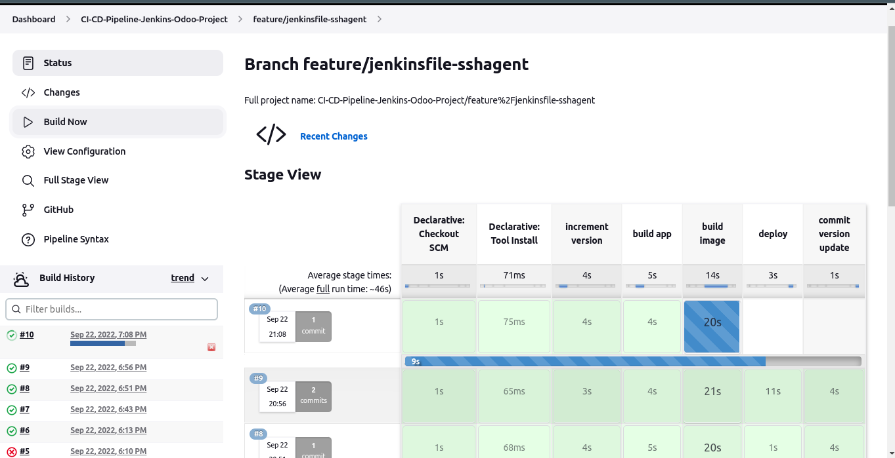
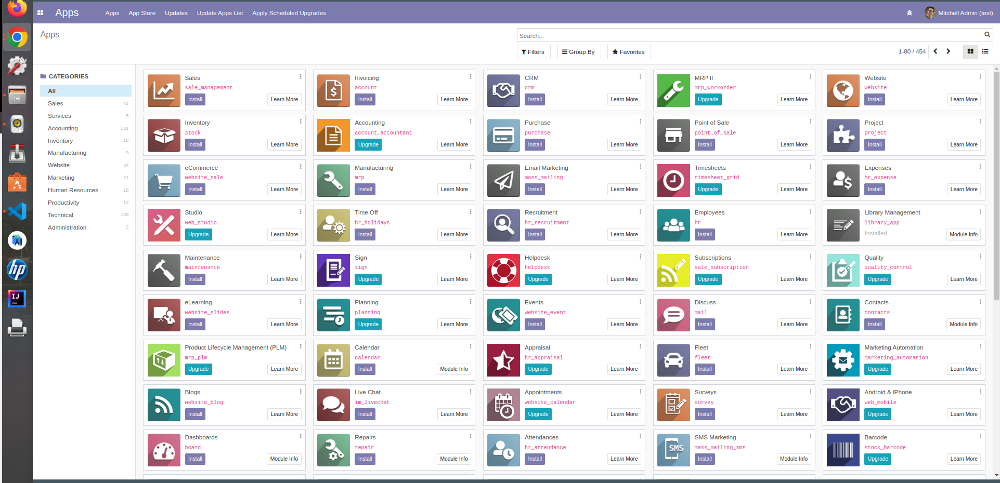
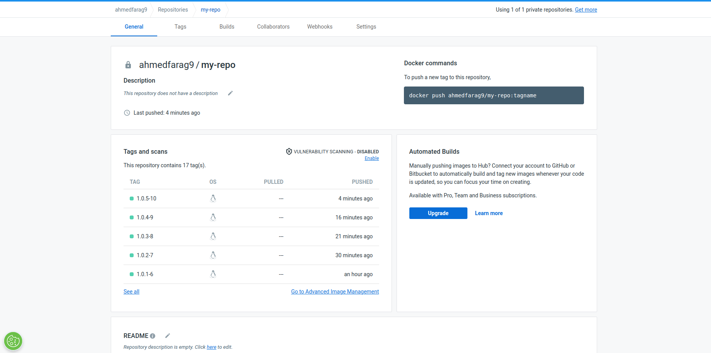
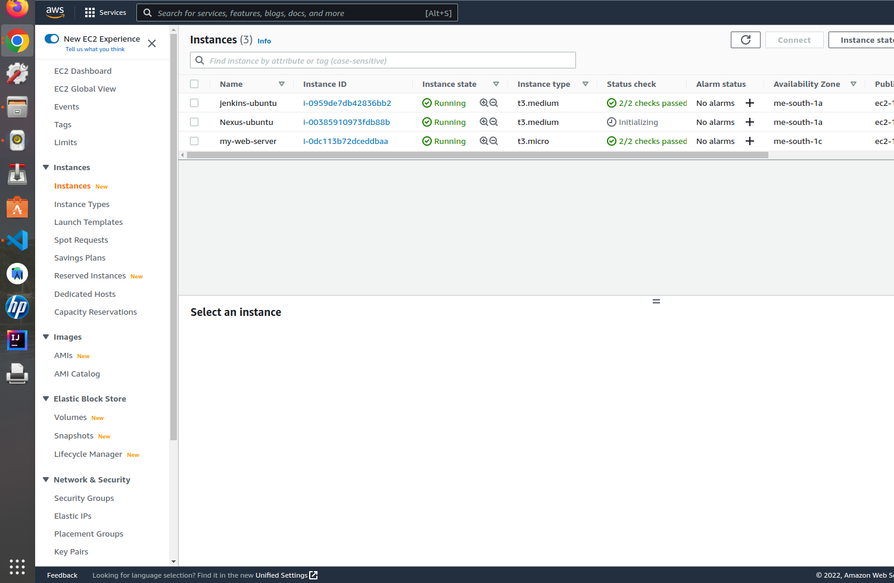
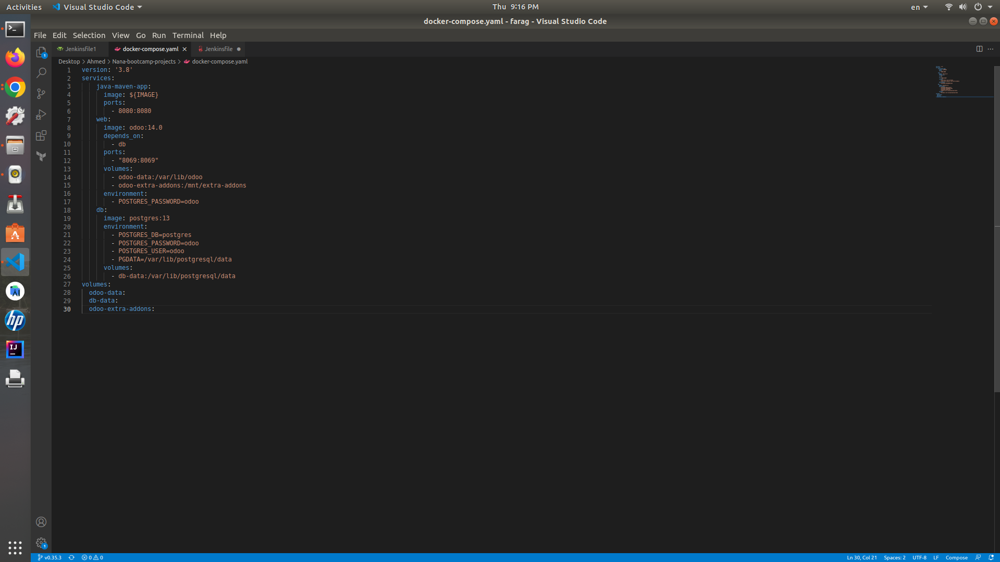
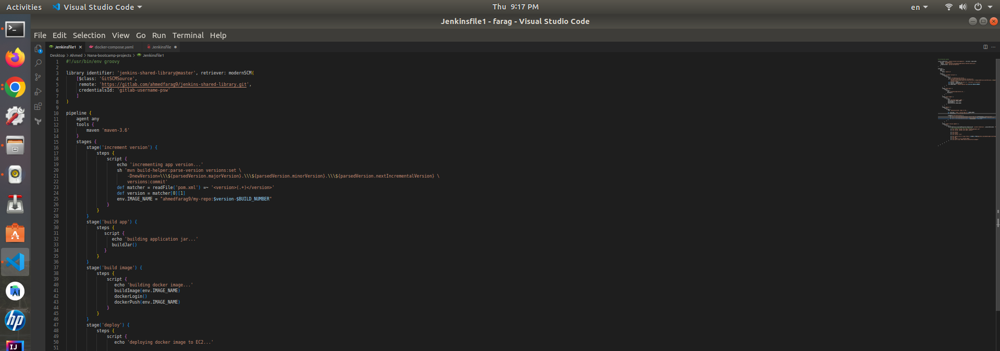

# Complete-CI-CD-Pipeline-with-Jenkins

A **Multi-branch pipeline** triggered automatically on code changes (Using GitHub WebHooks).

It builds a dockerized Postgresql instance & Odoo ERP instance with a custom module I created to handle work in a public library. 

It tests and builds A Java Maven App into a docker image implementing automatic app version increment.

Then it pushes the java app image to dockerHub repo and publish changes to github automatically.

------------

## Used Tools and Technologies

- [Amazon AWS EC2-Instance](https://aws.amazon.com/) Cloud services
- [Jenkins](https://www.jenkins.io/) (CI/CD) Automation software
- [Docker, docker-compose, docker-volumes & docker-networks](https://www.docker.com/) Containerization Tool
- [DockerHub](https://hub.docker.com/) Container Registry
- [GitHub WebHooks](https://docs.github.com/en/developers/webhooks-and-events/webhooks/about-webhooks) User-defined HTTP callbacks
- [GitLab] (https://gitlab.com/)
- [Maven](https://maven.apache.org/) Open-source build tool for Java
- [Odoo](https://www.odoo.com/) Open-source ERP system
- [Odoo Custom Module](https://github.com/ahmedfarag9/library_app) I created a custom module to handle work in a public library
- Bash Scripting
- Python

---

## Preview

- Jenkins Multi-branch Pipeline

---

- Odoo AWS instance preview

---

- Maven app versions on DockerHub repo

---

- AWS instances setup

---

- Odoo Docker Compose Yaml file

---

- Jenkins Automation File

---
